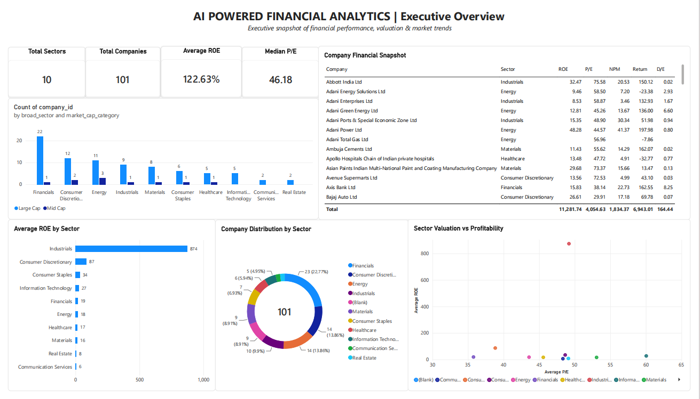
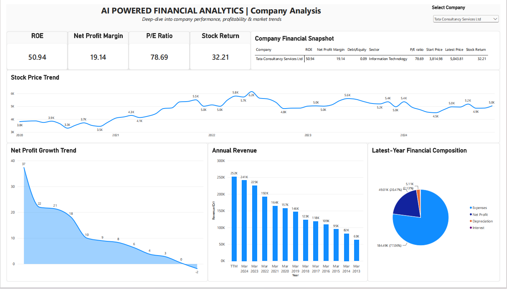
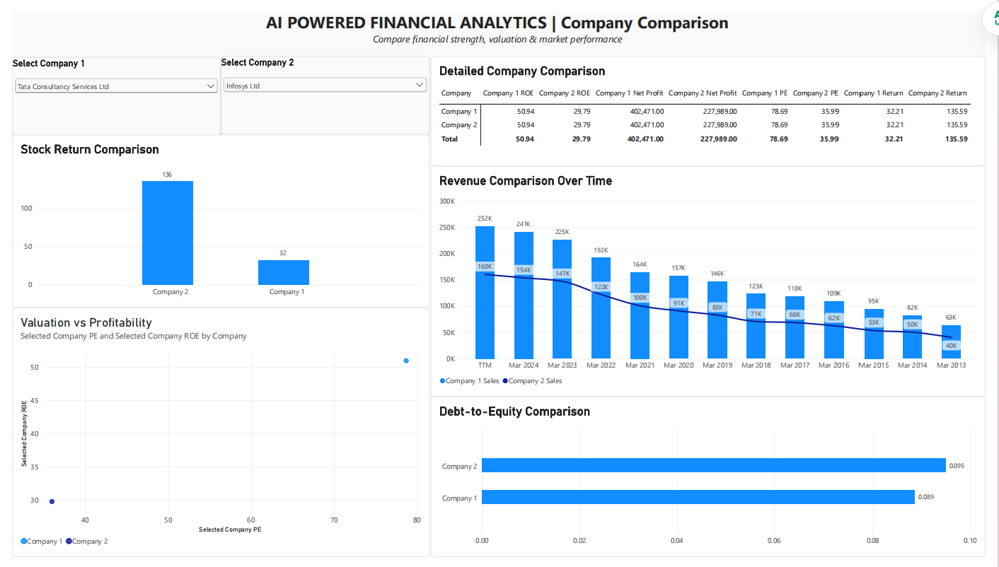
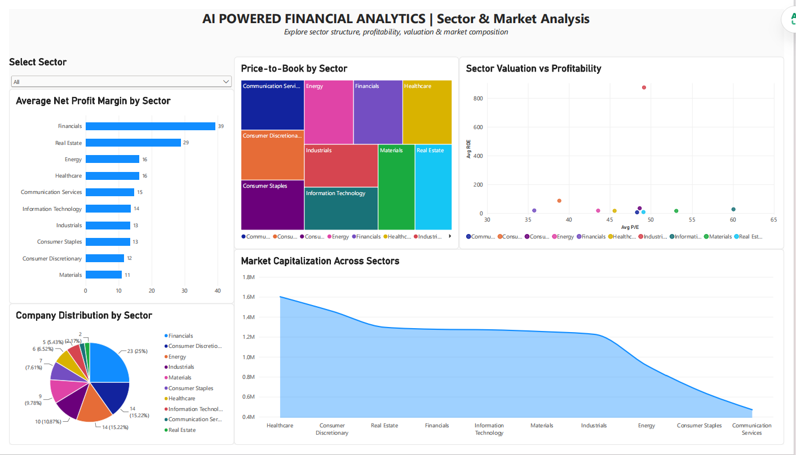
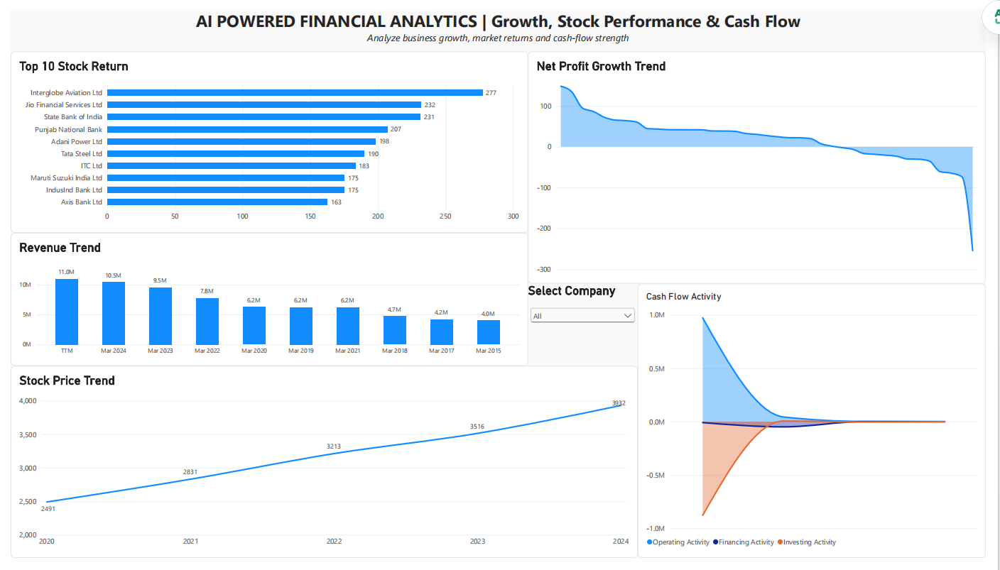
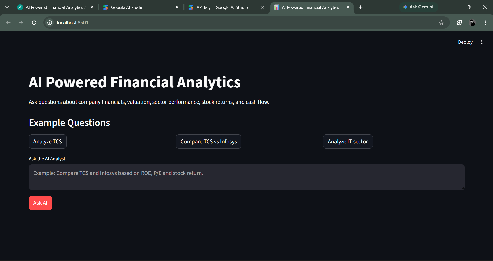
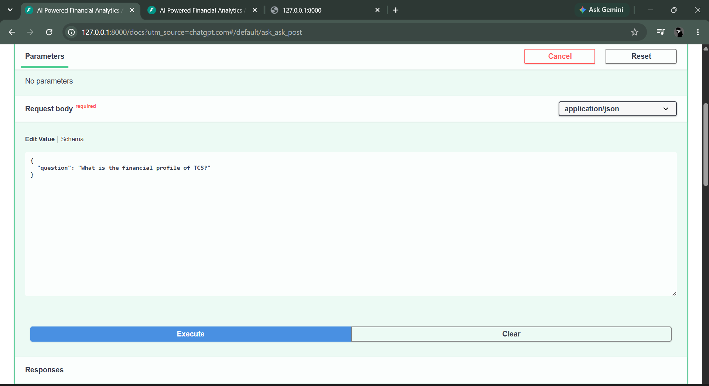
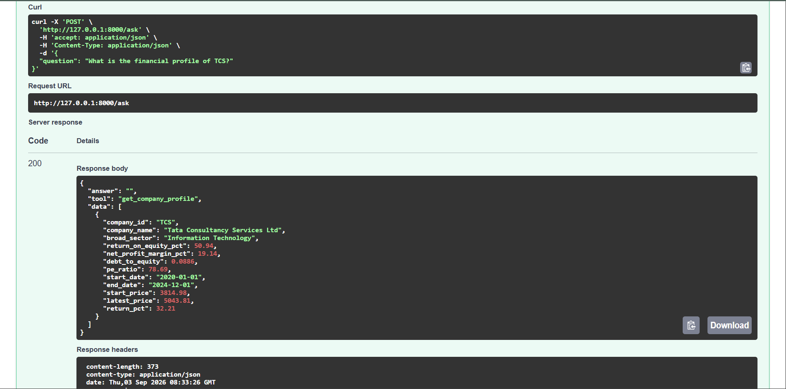

# 📊 AI Powered Financial Analytics

> An end-to-end financial analytics platform that combines **SQL, Python, Power BI, Generative AI, FastAPI, and Streamlit** to turn structured financial data into interactive dashboards and natural-language insights.

---

## 🚀 Overview

Financial data is often spread across multiple tables, financial statements, valuation metrics, market data, and company-level records.

This project brings these datasets together into a single analytics platform where users can:

- Explore financial performance through interactive Power BI dashboards
- Analyze companies and sectors
- Compare companies across key financial metrics
- Study valuation and stock performance
- Analyze revenue, profitability and cash-flow trends
- Ask financial questions in natural language
- Receive AI-generated insights based on data retrieved from MySQL

The core idea is to combine **traditional data analytics with AI-assisted analysis**.

Instead of asking an LLM to guess an answer, the AI analyst first identifies the appropriate analytical tool, retrieves the relevant data from the database, and then generates an explanation based on those results.

---

# 🧠 What Makes This Project Different?

This is not just a Power BI dashboard and not just an LLM chatbot.

It combines:

```text
                 USER
                  │
        ┌─────────┴─────────┐
        │                   │
        ▼                   ▼
   POWER BI            AI ANALYST
   Dashboard            Streamlit
                            │
                            ▼
                         FastAPI
                            │
                            ▼
                        Gemini LLM
                            │
                            ▼
                     Tool Selection
                            │
                            ▼
                      Python Tools
                            │
                            ▼
                     SQL Validation
                            │
                            ▼
                          MySQL
                            │
                            ▼
                   Analytical SQL Views
                            │
                            ▼
                       Financial Data
✨ Key Features
📊 Interactive Power BI Analytics

The Power BI dashboard contains five analytical pages:

1. Executive Overview

Provides a high-level snapshot of:

Total companies
Total sectors
Average ROE
Median P/E
Company distribution by sector
Sector valuation vs profitability
Top companies by ROE
Top stock performers
Company financial snapshot
2. Company Analysis

Provides company-level analysis including:

Stock price trends
Revenue trends
Net profit growth
ROE
Net profit margin
Debt-to-equity
P/E ratio
Historical stock returns

A company slicer allows users to explore individual companies.

3. Company Comparison

Allows users to compare two companies across:

Revenue
ROE
Net profit margin
Debt-to-equity
P/E ratio
Stock returns
Overall financial metrics

Example:

Compare TCS and Infosys based on profitability, valuation and stock performance.

4. Sector & Market Analysis

Provides sector-level analysis of:

Company distribution
Average profitability
Market capitalization
Valuation
ROE
Net profit margin
P/E
P/B

Users can filter the analysis by sector.

5. Growth, Stock Performance & Cash Flow

Combines:

Revenue growth
Net profit growth
Stock returns
Stock price trends
Operating cash flow
Financing cash flow
Investing cash flow
🤖 AI Financial Analyst

The project includes a Gemini-powered AI analyst that allows users to interact with the financial database using natural language.

Instead of writing SQL manually, a user can ask:

Compare TCS and Infosys.

or:

Analyze the Information Technology sector.

or:

Which companies have the highest stock returns?

The AI determines which analytical tool should be used, retrieves the required information, and generates a concise explanation.

🔧 AI Tool Calling

The AI analyst currently has six analytical tools:

Tool	Purpose
get_company_profile	Retrieves company financial profile and stock performance
compare_companies	Compares two companies
get_sector_analysis	Retrieves sector-level financial metrics
get_valuation	Retrieves valuation metrics
get_stock_performance	Retrieves historical stock performance
run_readonly_sql	Executes safe SELECT/WITH queries when predefined tools are insufficient
Example flow
User Question
     ↓
Gemini
     ↓
Select Analytical Tool
     ↓
Python Function
     ↓
MySQL
     ↓
Analytical View / Query
     ↓
Retrieved Data
     ↓
Gemini
     ↓
Natural Language Insight

This approach helps keep the generated answers grounded in the available financial data.

🛡️ SQL Safety Layer

The AI analyst includes a read-only SQL validation layer.

The system allows:

SELECT

and

WITH

queries.

It blocks operations such as:

INSERT
UPDATE
DELETE
DROP
ALTER
TRUNCATE
CREATE
RENAME
GRANT
REVOKE

This prevents the AI analyst from performing database modification operations through the read-only SQL tool.

🗄️ Data & Database Layer

The project uses MySQL as the central analytical database.

The database contains structured financial information covering:

Companies
Balance sheets
Cash flows
Profit & loss
Financial KPIs
Valuation
Stock prices
Sectors
Sector mapping
Peer groups
Documents
Pros and cons
Market capitalization
NIFTY analysis
📐 Analytical SQL Views

Several SQL views were created to simplify recurring analytical queries.

Key views include:

company_latest_summary
company_profitability
company_valuation
company_stock_performance
sector_performance
company_financial_ranking
company_investment_overview
company_growth
company_cashflow
company_master_profile

These views form the analytical layer between raw financial tables and the AI/Python applications.

🐍 Python Analytics Layer

Python is used for:

Data processing
MySQL connectivity
Analytical functions
AI tool execution
DataFrame processing
JSON-compatible result generation

The project uses reusable Python functions rather than embedding all analytical logic directly inside the API.

⚡ FastAPI Backend

FastAPI provides the API layer for the AI analyst.

Available endpoints
Method	Endpoint	Purpose
GET	/	API status
GET	/health	Health check
POST	/ask	Submit a financial question
Example request
{
  "question": "Compare TCS and Infosys"
}
Example response structure
{
  "answer": "TCS has a higher ROE...",
  "tool": "compare_companies",
  "data": []
}
🖥️ Streamlit AI Interface

A Streamlit frontend provides a simple user-facing interface for the AI analyst.

Users can:

Enter a financial question
Submit the question
Receive an AI-generated insight
See which analytical tool was used
View the retrieved database results

This provides a conversational interface on top of the FastAPI + Gemini + MySQL analytics pipeline.

🧹 Data Preparation

The original financial datasets were cleaned before loading them into MySQL.

The data preparation process included:

Header normalization
Removing unnecessary title/header rows
Standardizing column names
Handling missing values
Removing duplicate records where appropriate
Data type validation
Company/year consistency checks
Preparing analytical CSV datasets
Loading cleaned data into MySQL

The cleaned datasets are stored separately from the original raw datasets.

📈 Key Financial Metrics

The project analyzes several important financial and market metrics.

Profitability
Return on Equity (ROE)
Net Profit Margin
Operating Profit Margin
Leverage
Debt-to-Equity
Total Debt
Interest Coverage
Valuation
P/E Ratio
P/B Ratio
EV/EBITDA
Dividend Yield
Growth
Revenue Growth
Net Profit Growth
Market Performance
Stock Price
Historical Stock Return
Market Capitalization
Cash Flow
Cash From Operations
Investing Cash Flow
Financing Cash Flow
Free Cash Flow
Capital Expenditure
🧪 Example AI Questions

The AI analyst can handle questions such as:

Give me the financial profile of TCS.
Compare TCS and Infosys.
Analyze the Information Technology sector.
Show companies with the lowest P/E ratios.
Which companies had the highest stock returns?
Compare profitability and valuation of two companies.
What are the major financial trends for a company?

The predefined analytical tools are preferred whenever they can answer the question. The read-only SQL tool is used when a more specific query is required.

🏗️ Project Structure
Financial Analytics Project/
│
├── AI Analyst/
│   └── app.py
│
├── Cleaned Data/
│   ├── balance_sheet_clean.csv
│   ├── cash_flow_clean.csv
│   ├── financial_kpis_clean.csv
│   ├── profit_loss_clean.csv
│   ├── valuation_clean.csv
│   ├── stock_prices_clean.csv
│   └── ...
│
├── DOCUMENTATION/
│
├── IMAGES/
│
├── PowerBI/
│   └── Financial Analytics Dashboard.pbix
│
├── Python/
│   ├── notebooks/
│   │   └── 11_Python_MySQL_LLM.ipynb
│   │
│   └── backend/
│       ├── database.py
│       ├── llm.py
│       ├── main.py
│       ├── sql_validator.py
│       ├── tools.py
│       ├── test_tools.py
│       └── requirements.txt
│
├── Raw Data/
│
├── SQL/
│   ├── tables/
│   ├── views/
│   └── queries/
│
├── .gitignore
│
└── Readme.md
⚙️ Technology Stack
Technology	Purpose
Python	Data processing and analytics
Pandas	Data manipulation
MySQL	Financial analytics database
SQL	Data querying and analytical views
Power BI	Interactive dashboards
Gemini	Natural-language understanding and tool selection
FastAPI	Backend API
Streamlit	AI analyst frontend
Jupyter Notebook	Development and experimentation
🔐 Security & Configuration

API keys and database credentials are stored using environment variables.

Example .env:

GEMINI_API_KEY=your_api_key
MYSQL_HOST=localhost
MYSQL_USER=root
MYSQL_PASSWORD=your_password
MYSQL_DATABASE=financial_analytics

The .env file is excluded from Git using .gitignore.

Credentials should never be committed to the repository.

🚀 Running the Project Locally
1. Clone the repository
git clone <your-repository-url>
cd "Financial Analytics Project"
2. Install dependencies

Backend dependencies:

pip install -r Python/backend/requirements.txt

Streamlit dependencies:

pip install streamlit requests
3. Configure environment variables

Create a .env file in the backend directory:

GEMINI_API_KEY=your_api_key
MYSQL_HOST=localhost
MYSQL_USER=root
MYSQL_PASSWORD=your_password
MYSQL_DATABASE=financial_analytics
4. Start MySQL

Make sure MySQL is running and the financial_analytics database has been populated with the required tables and analytical views.

5. Start the FastAPI backend
cd Python/backend
python -m uvicorn main:app --reload

The API will be available at:

http://127.0.0.1:8000

Swagger documentation:

http://127.0.0.1:8000/docs
6. Start the Streamlit application

Open another terminal:

cd "AI Analyst"
streamlit run app.py

The AI Analyst interface will normally be available at:

http://localhost:8501
📊 Dashboard Preview

Screenshots and project visuals are available in:

IMAGES/

The Power BI dashboard contains five pages covering executive analysis, company analysis, comparison, sector analysis, and growth/market/cash-flow analysis.

🔄 End-to-End Workflow
Raw Financial Data
        ↓
Data Cleaning & Validation
        ↓
Cleaned CSV Files
        ↓
MySQL Database
        ↓
Analytical SQL Views
        ↓
Python Analytics Functions
        ↓
Gemini Tool Calling
        ↓
FastAPI API
        ↓
Streamlit AI Interface
        ↓
Natural Language Financial Insights

At the same time:

MySQL
  ↓
Power BI
  ↓
Interactive Financial Dashboard
🎯 Project Objectives

The project was built to demonstrate how traditional analytics can be enhanced using Generative AI.

Primary objectives
Build an end-to-end financial analytics pipeline
Practice data cleaning and preparation
Design a relational analytical database
Create reusable SQL analytical views
Perform financial analysis using Python
Build interactive Power BI dashboards
Integrate an LLM with structured financial data
Implement AI tool/function calling
Add a read-only SQL safety layer
Expose analytics through FastAPI
Build a user-facing AI analytics interface
💡 Key Learning Outcomes

Through this project, I worked across multiple layers of a modern analytics stack:

Data Engineering
      ↓
SQL Analytics
      ↓
Python
      ↓
Business Intelligence
      ↓
Generative AI
      ↓
API Development
      ↓
AI Application Interface

The project helped demonstrate how an analyst can move beyond static reporting and build systems where users can interact with data using natural language.

# 📊 Power BI Dashboard

## 1. Executive Overview



## 2. Company Analysis



## 3. Company Comparison



## 4. Sector & Market Analysis



## 5. Growth, Stock Performance & Cash Flow



---

# 🤖 AI Analyst

## Streamlit Frontend



## FastAPI Backend



## AI Tool Calling




⚠️ Disclaimer

This project is intended for educational, analytical, and portfolio purposes.

The financial analysis is based on the datasets available within the project and should not be considered investment advice.

Historical stock performance does not guarantee future results.

👨‍💻 Author

Saksham Deo

B.Tech Computer Science Engineering — 2026

Interested in:

Data Analytics
Business Intelligence
SQL
Python
Generative AI
AI-powered Analytics
Data Applications